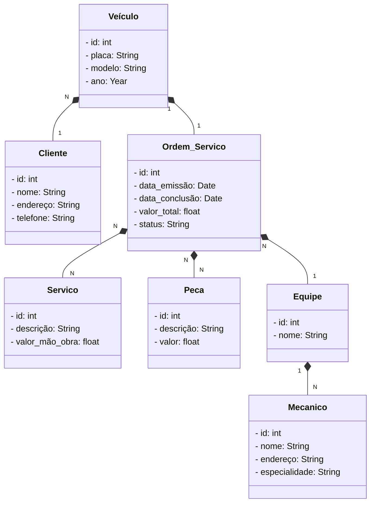

# Modelo Lógico Oficina Mecânica

## Diagrama de Classes

```mermaid
classDiagram
    class Veículo {
        - id: int
        - placa: String
        - modelo: String
        - ano: Year
    }

    class Cliente {
        - id: int
        - nome: String
        - endereço: String
        - telefone: String
    }

    class Ordem_Servico {
        - id: int
        - data_emissão: Date
        - data_conclusão: Date
        - valor_total: float
        - status: String
    }

    class Servico {
        - id: int
        - descrição: String
        - valor_mão_obra: float
    }

    class Peca {
        - id: int
        - descrição: String
        - valor: float
    }

    class Equipe {
        - id: int
        - nome: String
    }

    class Mecanico {
        - id: int
        - nome: String
        - endereço: String
        - especialidade: String
    }

    Veículo "N" *-- "1" Cliente
    Veículo "1" *-- "1" Ordem_Servico
    Ordem_Servico "N" *-- "1" Equipe
    Equipe "1" *-- "N" Mecanico
    Ordem_Servico "N" *-- "N" Servico
    Ordem_Servico "N" *-- "N" Peca
```
